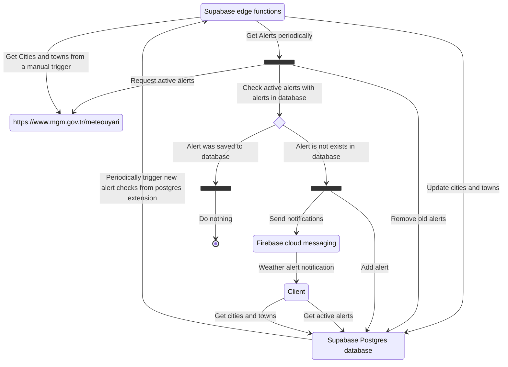

# meteo_uyari

Get live weather alerts and notifications from https://www.mgm.gov.tr

## Supported platforms

- Android
- Linux/Ubuntu (No notifications)

## Project diagram

```mermaid
stateDiagram-v2
  state "https://www.mgm.gov.tr/meteouyari" as mgm
  state "Supabase edge functions" as sfunc
    state "Supabase Postgres database" as sdb
  state "Firebase cloud messaging" as fcm
  state "Client" as client
  state isAlertSaved <<choice>>
  state forkAlertNew <<fork>>
  state forAlertIsNotOld <<fork>>
  state forkGetAlerts <<fork>>
    sfunc --> sdb : Update cities and towns
    sfunc --> forkGetAlerts : Get Alerts periodically
    forkGetAlerts --> mgm : Request active alerts
    forkGetAlerts --> sdb : Remove old alerts
    sfunc --> mgm : Get Cities and towns from a manual trigger
    forkGetAlerts --> isAlertSaved: Check active alerts with alerts in database
    isAlertSaved --> forkAlertNew : Alert is not exists in database
    forkAlertNew --> sdb: Add alert
    forkAlertNew --> fcm: Send notifications
    isAlertSaved --> forAlertIsNotOld : Alert was saved to database  
    forAlertIsNotOld --> [*]: Do nothing
    sdb --> sfunc : Periodically trigger new alert checks from postgres extension
    fcm --> client: Weather alert notification
    client --> sdb: Get active alerts
    client --> sdb: Get cities and towns
```
